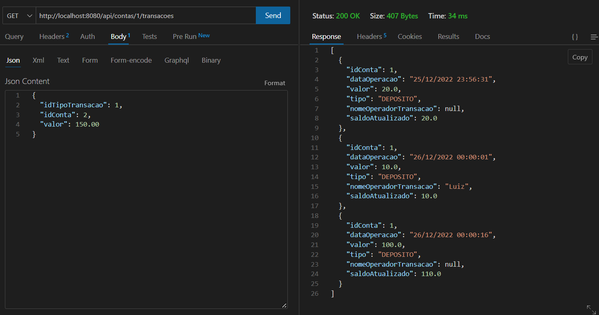
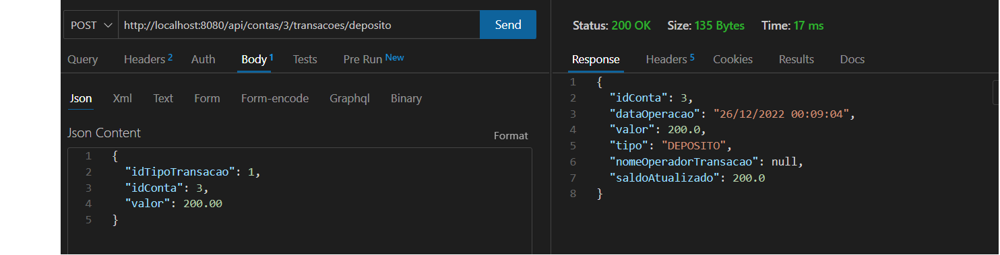
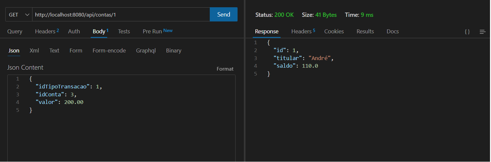
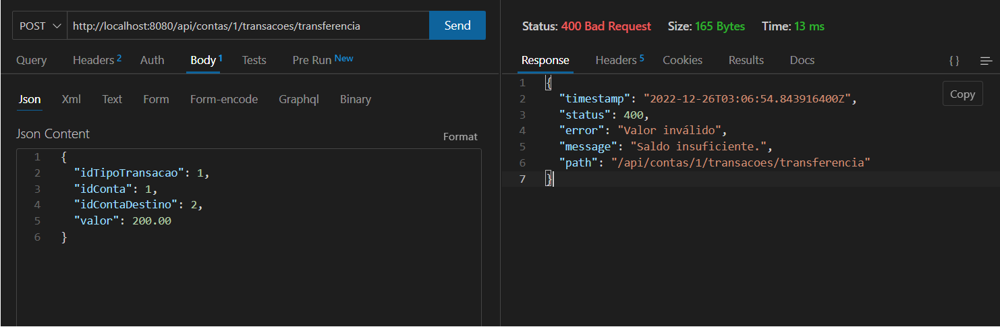

# Desafio de projeto Supera - Back-end

#### Bem-Vindo! 👋

## Objetivo

Criar uma API REST no contexto de uma instituição financeira, possibilitando a visualização de extrato bancário.

## Índice:

  - [Visão Geral](#visao-geral)
  - [Screenshots](#screenshots)
  - [Tecnologias](#tecnologias)
  - [Aprendizado](#aprendizado)
  - [Autor](#autor)

# Visão Geral

Para executar o projeto, utilizei o padrão de camadas MVC, com uma camada intermediária de Service entre as entidades e o controlador REST.
Realizei tratamento de exceções personalizados, devolvendo o STATUS HTTP correto conforme requisição.
Também fiz uso de alguns objetos DTO, e Spring Data JPA para persistência dos dados.

### Screenshots

##### GET Transações  

##### Realizando um depósito  

##### Exception: Tentativa de transferência com saldo insuficiente  

## Tecnologias

- Java JDK 17
- Spring Framework
- REST API
- JPA
- H2 Database SQL

## Aprendizado
Conseguir mapear os processos de depósito, saque e principalmente transferências, mapeando os possíveis erros que impedem a transação e barra-la quando necessário.
Esse contexto de Banco é um ótimo exercício para pensar em regras de negócio que fazem sentido.

## Autor

- GitHub - [André Cruz](https://github.com/andreldcm989)
- LinkedIn - [André Cruz](https://www.linkedin.com/in/andreldcruz/)
